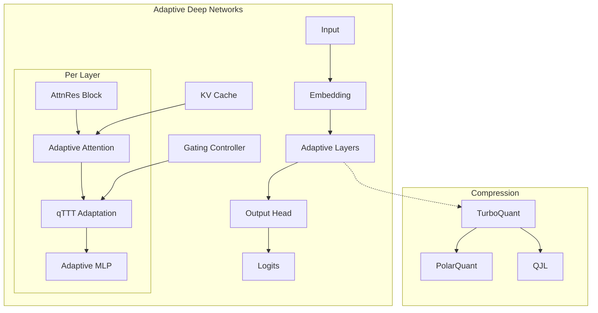
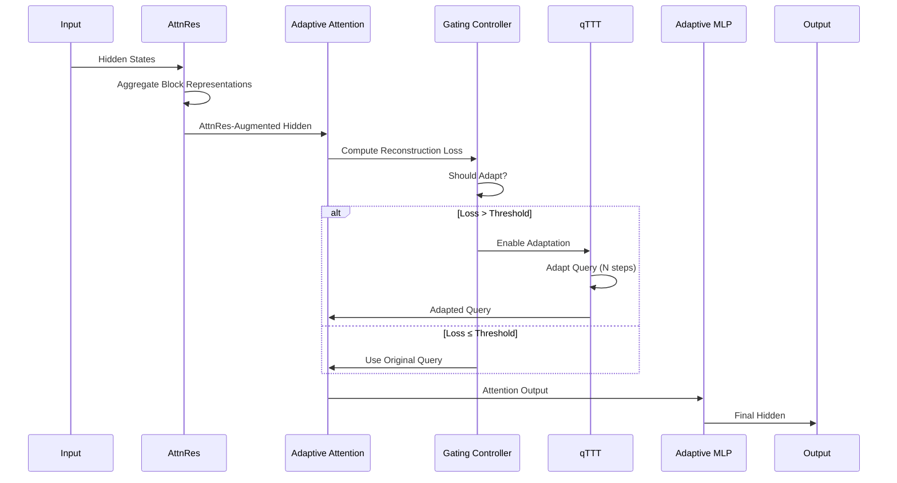
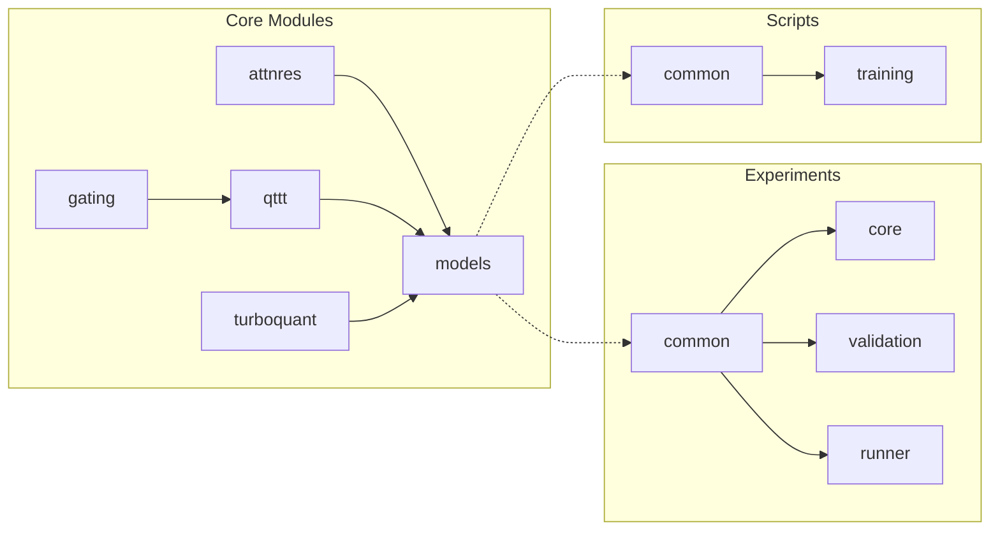
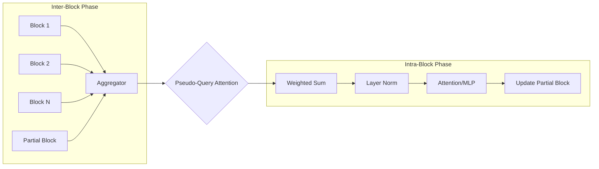
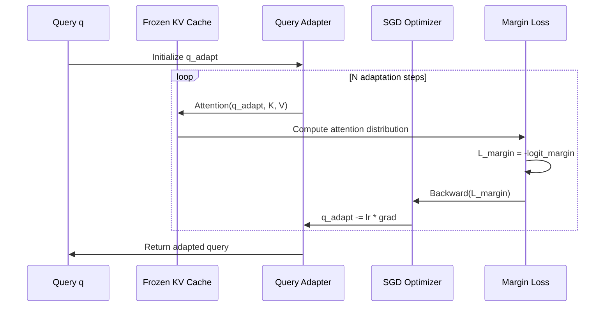
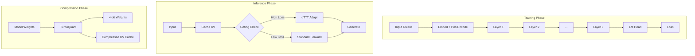

# Architecture Documentation

## System Overview

Adaptive Deep Networks (ADN) is a modular transformer architecture designed for efficient long-context inference through three key innovations:

1. **Attention Residuals (AttnRes)** - Prevents representation burial
2. **Dynamic Gating with qTTT** - Adaptive computation allocation
3. **TurboQuant** - 6x model compression

## High-Level Architecture



## Component Interactions



## Module Dependencies



## Attention Residuals (AttnRes) Flow



## qTTT Adaptation Flow



## TurboQuant Compression Pipeline

```mermaid
graph TB
    A[Input Vector x] --> B[Random Hadamard Transform]
    B --> C[Cartesian to Polar]
    C --> D[Magnitude r]
    C --> E[Angles θ]
    
    E --> F[Lloyd-Max Quantization]
    F --> G[Quantized θ indices]
    
    D --> H[QJL Residual]
    H --> I[Compute residual e]
    I --> J[Project Se]
    J --> K[Sign(Se)]
    
    L[Compressed] --> M[r: FP16]
    L --> N[θ: 3-bit]
    L --> O[sign: 1-bit]
```

## Data Flow Through System



## Directory Structure

```
Adaptive-Deep-Networks/
├── src/                          # Core implementation
│   ├── attnres/                  # Attention Residuals
│   │   ├── block_attnres.py     # Main implementation
│   │   └── pseudo_query.py      # Pseudo-query management
│   ├── qttt/                     # Query-Only TTT
│   │   ├── adaptation.py        # Core adaptation logic
│   │   ├── margin_loss.py       # Margin maximization
│   │   └── polar_adaptation.py  # Polar coordinate variant
│   ├── gating/                   # Dynamic gating
│   │   ├── threshold.py         # Threshold calibration
│   │   ├── reconstruction.py    # Loss computation
│   │   └── depth_priority.py    # Depth-priority policy
│   ├── models/                   # Model definitions
│   │   ├── adaptive_transformer.py
│   │   └── configs.py
│   └── turboquant/               # Compression
│       ├── polar_quant.py       # Polar quantization
│       ├── qjl.py               # QJL transform
│       └── turbo_quant.py       # Pipeline
│
├── experiments/                  # Experiment framework
│   ├── common/                   # Shared utilities
│   ├── core/                     # Core experiments (exp1-6)
│   ├── validation/               # Paper validation
│   └── real_model/              # Real model validation
│
├── scripts/                      # Training scripts
│   ├── common/                   # Shared training code
│   └── train_refactored.py      # Unified training
│
├── configs/                      # Configuration files
│   └── experiments/
│
├── tests/                        # Test suite
│   └── unit/
│
└── docs/                         # Documentation
    ├── api/                      # API docs
    └── ARCHITECTURE.md          # This file
```

## Key Design Decisions

### 1. Block-Based Attention
- **Why**: Reduces memory from O(Ld) to O(Nd)
- **Trade-off**: Slight approximation for significant efficiency gain
- **Implementation**: `block_attn_res()` function

### 2. Query-Only Adaptation
- **Why**: Only 0.5% of parameters need updating
- **Benefit**: Fast adaptation without model modification
- **Implementation**: `QueryOnlyTTT` class

### 3. Polar Quantization
- **Why**: Natural separation of magnitude and direction
- **Benefit**: Better preserves relative rankings
- **Implementation**: `PolarQuant` class

### 4. YAML Configuration
- **Why**: Human-readable, version-controllable
- **Benefit**: Easy experiment reproduction
- **Implementation**: `ExperimentConfig` class

## Performance Considerations

| Component | Memory | Compute | Communication |
|-----------|--------|---------|---------------|
| AttnRes | O(Nd) | O(N²d) | O(Nd) |
| qTTT | O(d) | O(N_adapt × d) | O(1) |
| TurboQuant | O(d/6) | O(d) | O(d/6) |

## Extension Points

1. **New Architectures**: Extend `BaseExperiment`
2. **New Gating Policies**: Extend `DynamicThreshold`
3. **New Compression**: Extend `TurboQuantPipeline`
4. **New Adaptation**: Extend `QueryOnlyTTT`

## References

- Chen et al. (2026): "Attention Residuals" Technical Report
- Bansal et al.: "Logit Margins" (for margin requirement)
- Adaptive Deep Networks Paper (Appendix A)
